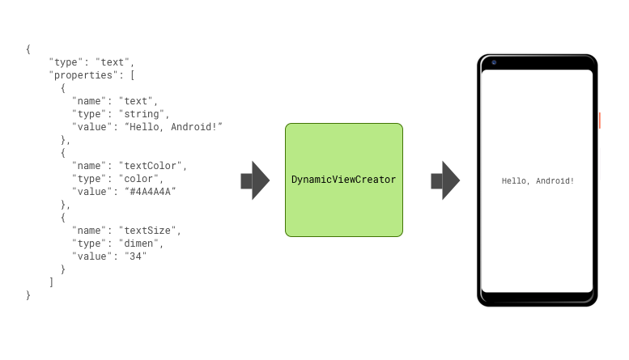
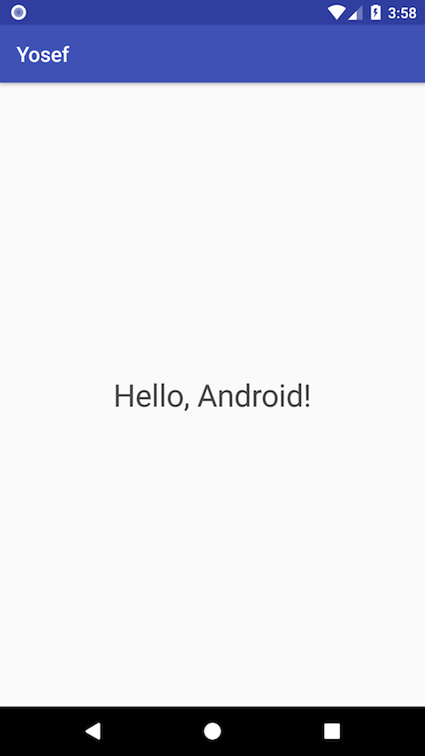

Yosef
===================

Yousef is a multi-platform library that generates views from JSON specification.
It's useful for A/B testing and providing users with dynamic content without shipping updates to the Play Store.




JSON Specification
-------------------------------

The JSON specification is very simple. We only have two entity models that describe how to represent a view (component) 
and how to style these components (properties). Our goal was to make the library as extensible as possible,
so you can create new components or properties as you grow you project (don't forget to contribute some of them 😊).

**DynamicComponent**

This entity represents what kind of component is going to be created by the `ViewCreator`:

* `type`: Type (name) used to find the component inside the `ViewCreator`
* `properties`: A list of `DynamicProperty` elements that should be applied to the component
* `children`: A list of `DynamicComponent` elements that will be added to this component as children (only supported by `ElementGroup` and `RadioGroupButton` as of now).

**DynamicProperty**

This entity represents a command that will be used to style and configure a `DynamicComponent` and has the following attributes:

* `name`: Name that will be associated to the command to be applied to the component
* `type`: Property type (e.g color, dimen, string, integer, float)
* `value`: The value associated to this property

You can see some example custom components we've built by taking a look at this project's modules,
specifically:

- [Picasso][1]
- [Glide][2]
- [Canarinho][3]
- [Lottie][4]


**Example usage**

The JSON

```json
[
  {
    "type": "text",
    "properties": [
      {
        "name": "text",
        "type": "string",
        "value": "Hello, Android!"
      },
      {
        "name": "textColor",
        "type": "color",
        "value": "#4A4A4A"
      },
      {
        "name": "textSize",
        "type": "dimen",
        "value": "30"
      }
    ],
    "children": null
  }
]
```

and Kotlin code

```kotlin

val parent = findViewById<FrameLayout>(R.id.parent)

val json = MainActivity::class.java
    .getResource("/assets/example_simple.json")
    .readText()

val creator = DynamicViewCreator.Builder()
    .build()

creator.createViewFromJson(parent, json, this)
```

will produce




**Using a custom component**

If you need extra components in your project, you can register this new component and its type (name) when building the `DynamicViewCreator`:

```kotlin

val creator = DynamicViewCreator.Builder()
    .addComponent("image", PicassoImageComponent())
    .build()

creator.createViewFromJson(parent, json, this)
```

Contributing your code
-------------------------------

See [CONTRIBUTING.md][contributing]

Android Team
-------------------------------

* Matheus Cassiano, matheus.candido@concrete.com.br
* Rodrigo Caetano, rodrigo.caetano@concrete.com.br
* Rodrigo Fogaça, rodrigo.fogaca@concrete.com.br
* Yasmin Bernardo, yasmin.pereira@concrete.com.br

[1]: picasso
[2]: glide
[3]: canarinho
[4]: lottie
[contributing]: CONTRIBUTING.md
